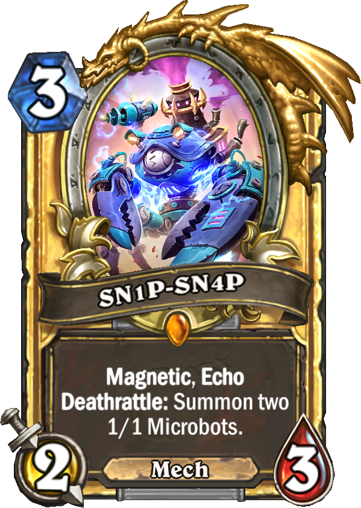

# SN1P-SN4P

Minimal set of snippets for Visual Studio Code 🦄

**React**, **Typescript** and **Shopify utilities**.

## Snippets

### React
| Snippet(s) | Renders                          |
| ------- | -------------------------------- |
| `import-react` / `imr` / `react-import`   | Import React |
| `react-component` / `rc`  | Scaffold a function component |
| `export-react` / `exr`  | React component export |
| `reexport-react` / `rexr`  | React component export and rename |
| `className` / `cn`  | CSS Modules ClassName |

### Typescript
| Snippet(s) | Renders                          |
| ------- | -------------------------------- |
| `clg`   | Console log |
| `arrow` / `arrow-func` / `af`  | Arrow function |

### Shopify
| Snippet(s) | Renders                          |
| ------- | -------------------------------- |
| `react-test` / `rt` | React component test |
| `import-checkout` / `imc`  | Import Checkout UI library |
| `mount-react` / `mtr`  | Mount Shopify testing |
| `expect-react` / `expr`  | Expect React component |
| `i18n` / `react-i18n`  | I18n utility |

## Release Notes

### 1.0.0

First version
